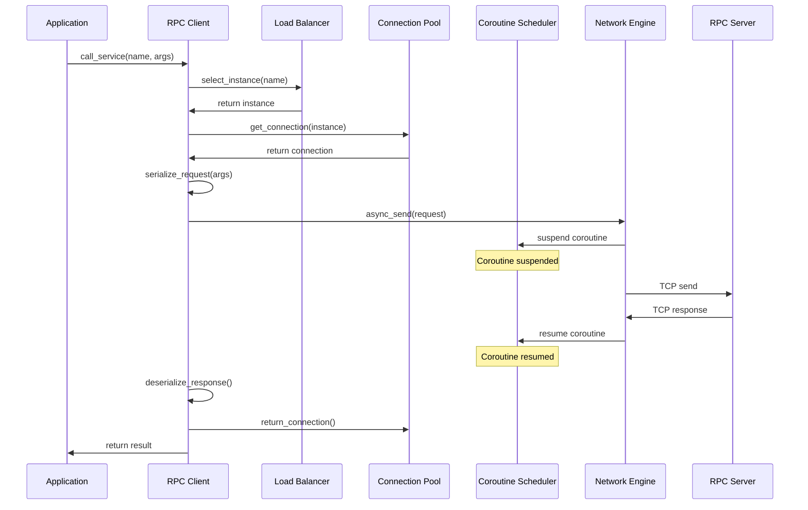
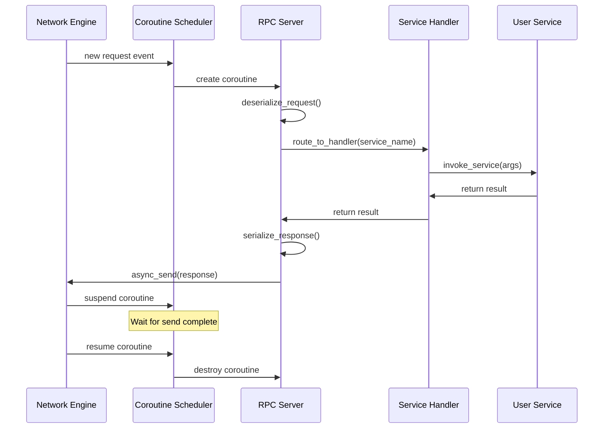

# FRPC 框架技术设计文档

## Overview

FRPC (Fast RPC Framework) 是一个基于 C++20 协程的高性能 RPC 框架，专为分布式系统设计。该框架的核心创新在于深度集成 C++20 无栈协程机制，将传统的异步回调模式转化为同步编写范式，大幅提升代码可读性和可维护性。

### 核心设计目标

1. **高性能**: 通过自研的非阻塞网络引擎和轻量级协程调度器，实现低延迟（P99 < 10ms）和高吞吐量（> 50,000 QPS）
2. **易用性**: 利用 C++20 协程语法（co_await, co_return），让开发者以同步代码风格编写异步逻辑
3. **可靠性**: 提供完善的服务治理机制，包括服务发现、健康检测、负载均衡和连接池管理
4. **可扩展性**: 支持插件式的序列化协议、自定义负载均衡策略和多种服务发现后端

### 技术栈

- **语言标准**: C++20
- **网络模型**: Reactor 模式（基于 epoll）
- **并发模型**: 协程 + 事件驱动
- **序列化**: 可插拔（默认支持二进制协议）
- **平台支持**: Linux (kernel 4.0+)

### 关键特性

- 基于 Reactor 模型的非阻塞网络引擎
- C++20 协程深度集成，支持 co_await 异步操作
- 轻量级协程调度器，优化内存分配（减少 80% 堆分配）
- 高效的连接池管理，降低 TCP 握手开销
- 动态服务发现和健康检测
- 多种负载均衡策略（轮询、随机、最少连接、加权轮询）
- 完善的错误处理和日志系统
- 线程安全的核心组件
- 灵活的配置管理系统


## Architecture

### 整体架构

FRPC 框架采用分层架构设计，从下到上分为五层：

```
┌─────────────────────────────────────────────────────────────┐
│                     Application Layer                       │
│              (User Service Implementation)                  │
└─────────────────────────────────────────────────────────────┘
                            ↕
┌─────────────────────────────────────────────────────────────┐
│                      RPC Layer                              │
│         RPC Client          │        RPC Server             │
│    - Service Invocation     │    - Service Registration     │
│    - Request Serialization  │    - Request Routing          │
│    - Response Handling      │    - Response Serialization   │
└─────────────────────────────────────────────────────────────┘
                            ↕
┌─────────────────────────────────────────────────────────────┐
│                  Service Governance Layer                   │
│  Service Registry │ Load Balancer │ Health Checker          │
│  Connection Pool  │ Config Manager                          │
└─────────────────────────────────────────────────────────────┘
                            ↕
┌─────────────────────────────────────────────────────────────┐
│                   Coroutine Layer                           │
│         Coroutine Scheduler │ Awaitable Objects             │
│         Promise Types       │ Memory Allocator              │
└─────────────────────────────────────────────────────────────┘
                            ↕
┌─────────────────────────────────────────────────────────────┐
│                    Network Layer                            │
│              Network Engine (Reactor Model)                 │
│         Event Loop │ Socket Manager │ Buffer Pool           │
└─────────────────────────────────────────────────────────────┘
```

### 核心组件交互流程

#### RPC 调用流程（客户端视角）



#### RPC 服务处理流程（服务端视角）



### 线程模型

FRPC 采用单线程事件循环 + 协程的并发模型：

- **主线程**: 运行事件循环，处理网络 I/O 事件
- **协程**: 每个 RPC 请求/响应在独立的协程中处理
- **线程安全组件**: Connection Pool、Service Registry、Coroutine Scheduler 支持多线程访问

可选的多线程模式：
- 多个事件循环线程，每个线程独立处理一组连接
- 使用线程池处理 CPU 密集型任务


## Components and Interfaces

### 1. Network Engine (网络引擎)

基于 Reactor 模式的非阻塞网络引擎，负责所有底层网络 I/O 操作。

#### 核心类设计

```cpp
/**
 * @brief 网络引擎 - 基于 Reactor 模式的事件驱动网络层
 * 
 * 使用 epoll 实现高效的事件多路复用，支持非阻塞 socket 操作。
 * 所有网络 I/O 操作都是异步的，通过回调或协程恢复通知完成。
 */
class NetworkEngine {
public:
    /**
     * @brief 启动事件循环
     * @throws NetworkException 如果初始化失败
     */
    void run();
    
    /**
     * @brief 停止事件循环
     */
    void stop();
    
    /**
     * @brief 注册 socket 读事件
     * @param fd 文件描述符
     * @param callback 事件触发时的回调函数
     * @return 注册是否成功
     */
    bool register_read_event(int fd, EventCallback callback);
    
    /**
     * @brief 注册 socket 写事件
     * @param fd 文件描述符
     * @param callback 事件触发时的回调函数
     * @return 注册是否成功
     */
    bool register_write_event(int fd, EventCallback callback);
    
    /**
     * @brief 注销事件
     * @param fd 文件描述符
     */
    void unregister_event(int fd);
    
    /**
     * @brief 异步发送数据（协程友好）
     * @param fd 文件描述符
     * @param data 要发送的数据
     * @return Awaitable 对象，可用于 co_await
     * 
     * @example
     * auto result = co_await engine.async_send(fd, data);
     * if (!result) {
     *     // 处理发送失败
     * }
     */
    Awaitable<SendResult> async_send(int fd, std::span<const uint8_t> data);
    
    /**
     * @brief 异步接收数据（协程友好）
     * @param fd 文件描述符
     * @param buffer 接收缓冲区
     * @return Awaitable 对象，返回实际接收的字节数
     * 
     * @example
     * auto bytes = co_await engine.async_recv(fd, buffer);
     * if (bytes > 0) {
     *     // 处理接收到的数据
     * }
     */
    Awaitable<ssize_t> async_recv(int fd, std::span<uint8_t> buffer);
    
    /**
     * @brief 异步连接到远程地址（协程友好）
     * @param addr 远程地址
     * @param port 远程端口
     * @return Awaitable 对象，返回连接的文件描述符
     */
    Awaitable<int> async_connect(const std::string& addr, uint16_t port);

private:
    int epoll_fd_;                          // epoll 文件描述符
    std::unordered_map<int, EventHandler> handlers_;  // fd -> 事件处理器映射
    std::atomic<bool> running_;             // 运行状态
    BufferPool buffer_pool_;                // 缓冲区池
};

/**
 * @brief 事件处理器
 */
struct EventHandler {
    EventCallback on_read;   // 读事件回调
    EventCallback on_write;  // 写事件回调
    EventCallback on_error;  // 错误事件回调
};
```

#### 设计要点

1. **非阻塞 I/O**: 所有 socket 设置为 O_NONBLOCK 模式
2. **边缘触发**: 使用 EPOLLET 模式提高性能
3. **缓冲区池**: 预分配缓冲区，避免频繁内存分配
4. **协程集成**: 提供 Awaitable 接口，支持 co_await 语法

### 2. Coroutine Scheduler (协程调度器)

轻量级协程调度器，管理协程的生命周期和内存分配。

#### 核心类设计

```cpp
/**
 * @brief 协程调度器 - 管理协程的创建、挂起、恢复和销毁
 * 
 * 实现自定义内存分配器，避免默认的堆分配。使用内存池技术
 * 优化协程帧的分配和释放，减少内存碎片。
 * 
 * @note 线程安全：支持多线程环境下的协程调度
 */
class CoroutineScheduler {
public:
    /**
     * @brief 创建新协程
     * @param func 协程函数
     * @return 协程句柄
     */
    template<typename Func>
    CoroutineHandle create_coroutine(Func&& func);
    
    /**
     * @brief 挂起当前协程
     * @param handle 协程句柄
     */
    void suspend(CoroutineHandle handle);
    
    /**
     * @brief 恢复协程执行
     * @param handle 协程句柄
     */
    void resume(CoroutineHandle handle);
    
    /**
     * @brief 销毁协程
     * @param handle 协程句柄
     */
    void destroy(CoroutineHandle handle);
    
    /**
     * @brief 查询协程状态
     * @param handle 协程句柄
     * @return 协程状态
     */
    CoroutineState get_state(CoroutineHandle handle) const;
    
    /**
     * @brief 分配协程帧内存
     * @param size 需要的字节数
     * @return 内存指针
     * 
     * @note 从内存池分配，避免堆分配开销
     */
    void* allocate_frame(size_t size);
    
    /**
     * @brief 释放协程帧内存
     * @param ptr 内存指针
     * @param size 字节数
     */
    void deallocate_frame(void* ptr, size_t size);

private:
    MemoryPool frame_pool_;                 // 协程帧内存池
    std::unordered_map<CoroutineHandle, CoroutineInfo> coroutines_;
    std::mutex mutex_;                      // 保护并发访问
    std::priority_queue<ScheduleTask> ready_queue_;  // 就绪队列（支持优先级）
};

/**
 * @brief 协程状态枚举
 */
enum class CoroutineState {
    Created,    // 已创建，未开始执行
    Running,    // 正在执行
    Suspended,  // 已挂起
    Completed,  // 已完成
    Failed      // 执行失败
};

/**
 * @brief 协程信息
 */
struct CoroutineInfo {
    CoroutineHandle handle;
    CoroutineState state;
    int priority;           // 优先级（数值越大优先级越高）
    void* frame_ptr;        // 协程帧指针
    size_t frame_size;      // 协程帧大小
};
```

#### Promise Type 设计

```cpp
/**
 * @brief RPC 任务的 Promise 类型
 * 
 * 控制协程的行为，包括初始挂起、最终挂起、返回值处理和异常处理。
 */
template<typename T>
struct RpcTaskPromise {
    /**
     * @brief 获取协程返回对象
     */
    RpcTask<T> get_return_object() {
        return RpcTask<T>{
            std::coroutine_handle<RpcTaskPromise>::from_promise(*this)
        };
    }
    
    /**
     * @brief 初始挂起点 - 协程创建后立即挂起
     */
    std::suspend_always initial_suspend() noexcept { return {}; }
    
    /**
     * @brief 最终挂起点 - 协程完成后挂起，等待销毁
     */
    std::suspend_always final_suspend() noexcept { return {}; }
    
    /**
     * @brief 处理 co_return 语句
     */
    void return_value(T value) {
        result_ = std::move(value);
    }
    
    /**
     * @brief 处理未捕获的异常
     */
    void unhandled_exception() {
        exception_ = std::current_exception();
    }
    
    /**
     * @brief 自定义内存分配 - 使用调度器的内存池
     */
    void* operator new(size_t size) {
        return CoroutineScheduler::instance().allocate_frame(size);
    }
    
    /**
     * @brief 自定义内存释放
     */
    void operator delete(void* ptr, size_t size) {
        CoroutineScheduler::instance().deallocate_frame(ptr, size);
    }

private:
    std::optional<T> result_;
    std::exception_ptr exception_;
};
```

#### Awaitable 对象设计

```cpp
/**
 * @brief 异步发送操作的 Awaitable 对象
 * 
 * 封装异步发送操作，使其可以通过 co_await 使用。
 * 当操作未完成时挂起协程，操作完成后恢复协程。
 */
struct SendAwaitable {
    /**
     * @brief 检查操作是否已完成
     * @return true 表示操作已完成，无需挂起
     */
    bool await_ready() const noexcept {
        return completed_;
    }
    
    /**
     * @brief 挂起协程
     * @param handle 当前协程句柄
     * 
     * 将协程句柄保存，以便操作完成后恢复。
     * 注册网络事件回调，当发送完成时恢复协程。
     */
    void await_suspend(std::coroutine_handle<> handle) {
        handle_ = handle;
        // 注册写事件，当 socket 可写时恢复协程
        engine_->register_write_event(fd_, [this]() {
            completed_ = true;
            CoroutineScheduler::instance().resume(handle_);
        });
    }
    
    /**
     * @brief 获取操作结果
     * @return 发送结果
     */
    SendResult await_resume() const {
        return result_;
    }

private:
    NetworkEngine* engine_;
    int fd_;
    bool completed_ = false;
    std::coroutine_handle<> handle_;
    SendResult result_;
};
```

### 3. RPC Server (RPC 服务端)

处理客户端请求，路由到对应的服务处理函数。

#### 核心类设计

```cpp
/**
 * @brief RPC 服务端
 * 
 * 负责接收客户端请求，反序列化请求数据，路由到对应的服务处理函数，
 * 序列化响应数据并发送回客户端。
 * 
 * @example 注册和启动服务
 * RpcServer server(config);
 * server.register_service("add", [](int a, int b) -> int {
 *     return a + b;
 * });
 * server.start();
 */
class RpcServer {
public:
    /**
     * @brief 构造函数
     * @param config 服务器配置
     */
    explicit RpcServer(const ServerConfig& config);
    
    /**
     * @brief 注册服务
     * @param service_name 服务名称
     * @param handler 服务处理函数
     * 
     * @example
     * server.register_service("echo", [](const std::string& msg) {
     *     return msg;
     * });
     */
    template<typename Func>
    void register_service(const std::string& service_name, Func&& handler);
    
    /**
     * @brief 启动服务器
     * @throws ServerException 如果启动失败
     */
    void start();
    
    /**
     * @brief 停止服务器
     */
    void stop();
    
    /**
     * @brief 获取服务器统计信息
     */
    ServerStats get_stats() const;

private:
    /**
     * @brief 处理客户端连接（协程）
     * @param fd 客户端 socket 文件描述符
     */
    RpcTask<void> handle_connection(int fd);
    
    /**
     * @brief 处理单个请求（协程）
     * @param request 请求对象
     * @return 响应对象
     */
    RpcTask<Response> handle_request(const Request& request);
    
    ServerConfig config_;
    NetworkEngine engine_;
    std::unordered_map<std::string, ServiceHandler> services_;
    std::atomic<bool> running_;
    ServiceRegistry* registry_;  // 服务注册中心（可选）
};

/**
 * @brief 服务处理器类型
 */
using ServiceHandler = std::function<RpcTask<Response>(const Request&)>;
```

### 4. RPC Client (RPC 客户端)

发起远程服务调用，处理请求和响应。

#### 核心类设计

```cpp
/**
 * @brief RPC 客户端
 * 
 * 提供远程服务调用接口，自动处理服务发现、负载均衡、
 * 连接管理、序列化和超时控制。
 * 
 * @example 调用远程服务
 * RpcClient client(config);
 * auto result = co_await client.call<int>("add", 1, 2);
 * if (result) {
 *     std::cout << "Result: " << *result << std::endl;
 * }
 */
class RpcClient {
public:
    /**
     * @brief 构造函数
     * @param config 客户端配置
     */
    explicit RpcClient(const ClientConfig& config);
    
    /**
     * @brief 调用远程服务（协程）
     * @tparam ReturnType 返回值类型
     * @tparam Args 参数类型
     * @param service_name 服务名称
     * @param args 服务参数
     * @param timeout 超时时间（毫秒），默认 5000ms
     * @return 服务调用结果
     * 
     * @throws TimeoutException 如果调用超时
     * @throws NetworkException 如果网络传输失败
     * @throws SerializationException 如果序列化/反序列化失败
     * 
     * @example
     * try {
     *     auto result = co_await client.call<std::string>("echo", "hello");
     *     std::cout << *result << std::endl;
     * } catch (const TimeoutException& e) {
     *     std::cerr << "Call timeout: " << e.what() << std::endl;
     * }
     */
    template<typename ReturnType, typename... Args>
    RpcTask<std::optional<ReturnType>> call(
        const std::string& service_name,
        Args&&... args,
        std::chrono::milliseconds timeout = std::chrono::milliseconds(5000)
    );
    
    /**
     * @brief 获取客户端统计信息
     */
    ClientStats get_stats() const;

private:
    /**
     * @brief 执行 RPC 调用（协程）
     */
    RpcTask<Response> do_call(const Request& request, 
                              std::chrono::milliseconds timeout);
    
    ClientConfig config_;
    NetworkEngine* engine_;
    ConnectionPool* pool_;
    LoadBalancer* load_balancer_;
    ServiceRegistry* registry_;
};
```


### 5. Connection Pool (连接池)

管理到服务实例的 TCP 连接，支持连接复用。

#### 核心类设计

```cpp
/**
 * @brief 连接池管理器
 * 
 * 维护到每个服务实例的连接集合，支持连接复用、自动清理和健康检测。
 * 
 * @note 线程安全：所有公共方法都是线程安全的
 */
class ConnectionPool {
public:
    /**
     * @brief 构造函数
     * @param config 连接池配置
     */
    explicit ConnectionPool(const PoolConfig& config);
    
    /**
     * @brief 获取到指定实例的连接（协程）
     * @param instance 服务实例
     * @return 连接对象
     * 
     * 优先返回空闲连接，如果没有空闲连接且未达到最大连接数，
     * 则创建新连接。如果达到最大连接数，则等待直到有连接可用。
     * 
     * @example
     * auto conn = co_await pool.get_connection(instance);
     * // 使用连接...
     * pool.return_connection(std::move(conn));
     */
    RpcTask<Connection> get_connection(const ServiceInstance& instance);
    
    /**
     * @brief 归还连接
     * @param conn 连接对象
     * 
     * 将连接标记为空闲并放回连接池。如果连接已损坏，则销毁连接。
     */
    void return_connection(Connection conn);
    
    /**
     * @brief 移除到指定实例的所有连接
     * @param instance 服务实例
     */
    void remove_instance(const ServiceInstance& instance);
    
    /**
     * @brief 获取连接池统计信息
     */
    PoolStats get_stats() const;
    
    /**
     * @brief 清理空闲超时的连接
     * 
     * 定期调用此方法清理长时间空闲的连接。
     */
    void cleanup_idle_connections();

private:
    /**
     * @brief 创建新连接（协程）
     */
    RpcTask<Connection> create_connection(const ServiceInstance& instance);
    
    struct InstancePool {
        std::vector<Connection> idle_connections;    // 空闲连接
        std::vector<Connection> active_connections;  // 活跃连接
        size_t total_count = 0;                      // 总连接数
    };
    
    PoolConfig config_;
    std::unordered_map<ServiceInstance, InstancePool> pools_;
    mutable std::shared_mutex mutex_;  // 读写锁
    NetworkEngine* engine_;
};

/**
 * @brief 连接对象
 */
class Connection {
public:
    /**
     * @brief 发送数据（协程）
     */
    RpcTask<SendResult> send(std::span<const uint8_t> data);
    
    /**
     * @brief 接收数据（协程）
     */
    RpcTask<std::vector<uint8_t>> recv();
    
    /**
     * @brief 检查连接是否有效
     */
    bool is_valid() const;
    
    /**
     * @brief 获取连接创建时间
     */
    std::chrono::steady_clock::time_point created_at() const;
    
    /**
     * @brief 获取最后使用时间
     */
    std::chrono::steady_clock::time_point last_used_at() const;

private:
    int fd_;
    ServiceInstance instance_;
    std::chrono::steady_clock::time_point created_at_;
    std::chrono::steady_clock::time_point last_used_at_;
    NetworkEngine* engine_;
};
```

### 6. Service Registry (服务注册中心)

维护服务名称到服务实例的映射，支持动态服务发现。

#### 核心类设计

```cpp
/**
 * @brief 服务注册中心
 * 
 * 维护服务名称到服务实例列表的映射，支持服务注册、注销、
 * 查询和变更通知。
 * 
 * @note 线程安全：所有公共方法都是线程安全的
 */
class ServiceRegistry {
public:
    /**
     * @brief 注册服务实例
     * @param service_name 服务名称
     * @param instance 服务实例信息
     * @return 注册是否成功
     * 
     * @example
     * ServiceInstance instance{"127.0.0.1", 8080, 100};
     * registry.register_service("user_service", instance);
     */
    bool register_service(const std::string& service_name, 
                         const ServiceInstance& instance);
    
    /**
     * @brief 注销服务实例
     * @param service_name 服务名称
     * @param instance 服务实例信息
     */
    void unregister_service(const std::string& service_name,
                           const ServiceInstance& instance);
    
    /**
     * @brief 查询服务实例列表
     * @param service_name 服务名称
     * @return 服务实例列表（仅包含健康的实例）
     */
    std::vector<ServiceInstance> get_instances(const std::string& service_name) const;
    
    /**
     * @brief 订阅服务变更通知
     * @param service_name 服务名称
     * @param callback 变更回调函数
     * 
     * 当服务实例列表发生变化时，调用回调函数通知订阅者。
     */
    void subscribe(const std::string& service_name, 
                  std::function<void(const std::vector<ServiceInstance>&)> callback);
    
    /**
     * @brief 更新实例健康状态
     * @param service_name 服务名称
     * @param instance 服务实例
     * @param healthy 是否健康
     */
    void update_health_status(const std::string& service_name,
                             const ServiceInstance& instance,
                             bool healthy);

private:
    struct InstanceInfo {
        ServiceInstance instance;
        bool healthy = true;
        std::chrono::steady_clock::time_point last_heartbeat;
    };
    
    std::unordered_map<std::string, std::vector<InstanceInfo>> services_;
    std::unordered_map<std::string, std::vector<std::function<void(const std::vector<ServiceInstance>&)>>> subscribers_;
    mutable std::shared_mutex mutex_;
};

/**
 * @brief 服务实例信息
 */
struct ServiceInstance {
    std::string host;      // 主机地址
    uint16_t port;         // 端口号
    int weight = 100;      // 权重（用于加权负载均衡）
    
    bool operator==(const ServiceInstance& other) const {
        return host == other.host && port == other.port;
    }
};
```

### 7. Load Balancer (负载均衡器)

从可用服务实例中选择一个实例处理请求。

#### 核心类设计

```cpp
/**
 * @brief 负载均衡器接口
 */
class LoadBalancer {
public:
    virtual ~LoadBalancer() = default;
    
    /**
     * @brief 选择服务实例
     * @param instances 可用的服务实例列表
     * @return 选中的服务实例
     * @throws NoInstanceAvailableException 如果没有可用实例
     */
    virtual ServiceInstance select(const std::vector<ServiceInstance>& instances) = 0;
};

/**
 * @brief 轮询负载均衡策略
 * 
 * 按顺序依次选择服务实例。
 */
class RoundRobinLoadBalancer : public LoadBalancer {
public:
    ServiceInstance select(const std::vector<ServiceInstance>& instances) override;

private:
    std::atomic<size_t> index_{0};
};

/**
 * @brief 随机负载均衡策略
 * 
 * 随机选择服务实例。
 */
class RandomLoadBalancer : public LoadBalancer {
public:
    ServiceInstance select(const std::vector<ServiceInstance>& instances) override;

private:
    std::mt19937 rng_{std::random_device{}()};
};

/**
 * @brief 最少连接负载均衡策略
 * 
 * 选择当前连接数最少的服务实例。
 */
class LeastConnectionLoadBalancer : public LoadBalancer {
public:
    explicit LeastConnectionLoadBalancer(ConnectionPool* pool);
    
    ServiceInstance select(const std::vector<ServiceInstance>& instances) override;

private:
    ConnectionPool* pool_;
};

/**
 * @brief 加权轮询负载均衡策略
 * 
 * 根据实例权重按比例选择服务实例。
 */
class WeightedRoundRobinLoadBalancer : public LoadBalancer {
public:
    ServiceInstance select(const std::vector<ServiceInstance>& instances) override;

private:
    std::atomic<size_t> current_weight_{0};
};
```

### 8. Health Checker (健康检测器)

定期检测服务实例的健康状态。

#### 核心类设计

```cpp
/**
 * @brief 健康检测器
 * 
 * 定期向服务实例发送健康检测请求，根据响应情况更新实例的健康状态。
 */
class HealthChecker {
public:
    /**
     * @brief 构造函数
     * @param config 健康检测配置
     * @param registry 服务注册中心
     */
    HealthChecker(const HealthCheckConfig& config, ServiceRegistry* registry);
    
    /**
     * @brief 启动健康检测
     */
    void start();
    
    /**
     * @brief 停止健康检测
     */
    void stop();
    
    /**
     * @brief 添加检测目标
     * @param service_name 服务名称
     * @param instance 服务实例
     */
    void add_target(const std::string& service_name, 
                   const ServiceInstance& instance);
    
    /**
     * @brief 移除检测目标
     * @param service_name 服务名称
     * @param instance 服务实例
     */
    void remove_target(const std::string& service_name,
                      const ServiceInstance& instance);

private:
    /**
     * @brief 检测循环（协程）
     */
    RpcTask<void> check_loop();
    
    /**
     * @brief 检测单个实例（协程）
     */
    RpcTask<bool> check_instance(const ServiceInstance& instance);
    
    struct TargetInfo {
        std::string service_name;
        ServiceInstance instance;
        int consecutive_failures = 0;  // 连续失败次数
    };
    
    HealthCheckConfig config_;
    ServiceRegistry* registry_;
    std::vector<TargetInfo> targets_;
    std::atomic<bool> running_;
    std::mutex mutex_;
};
```

### 9. Serializer/Deserializer (序列化器)

将对象序列化为字节流，或从字节流反序列化为对象。

#### 核心类设计

```cpp
/**
 * @brief 序列化器接口
 */
class Serializer {
public:
    virtual ~Serializer() = default;
    
    /**
     * @brief 序列化请求对象
     * @param request 请求对象
     * @return 字节流
     */
    virtual std::vector<uint8_t> serialize(const Request& request) = 0;
    
    /**
     * @brief 序列化响应对象
     * @param response 响应对象
     * @return 字节流
     */
    virtual std::vector<uint8_t> serialize(const Response& response) = 0;
    
    /**
     * @brief 反序列化请求对象
     * @param data 字节流
     * @return 请求对象
     * @throws SerializationException 如果格式无效
     */
    virtual Request deserialize_request(std::span<const uint8_t> data) = 0;
    
    /**
     * @brief 反序列化响应对象
     * @param data 字节流
     * @return 响应对象
     * @throws SerializationException 如果格式无效
     */
    virtual Response deserialize_response(std::span<const uint8_t> data) = 0;
};

/**
 * @brief 二进制序列化器（默认实现）
 * 
 * 使用自定义的二进制协议进行序列化，格式紧凑，性能高效。
 * 
 * 协议格式：
 * [4字节: 魔数] [4字节: 版本] [4字节: 消息类型] [4字节: 消息ID]
 * [4字节: 服务名长度] [N字节: 服务名] [4字节: 数据长度] [N字节: 数据]
 */
class BinarySerializer : public Serializer {
public:
    std::vector<uint8_t> serialize(const Request& request) override;
    std::vector<uint8_t> serialize(const Response& response) override;
    Request deserialize_request(std::span<const uint8_t> data) override;
    Response deserialize_response(std::span<const uint8_t> data) override;

private:
    static constexpr uint32_t MAGIC_NUMBER = 0x46525043;  // "FRPC"
    static constexpr uint32_t VERSION = 1;
};
```


## Data Models

### Request (请求对象)

```cpp
/**
 * @brief RPC 请求对象
 */
struct Request {
    uint32_t request_id;              // 请求 ID（用于匹配请求和响应）
    std::string service_name;         // 服务名称
    std::vector<uint8_t> payload;     // 序列化后的参数数据
    std::chrono::milliseconds timeout; // 超时时间
    std::unordered_map<std::string, std::string> metadata;  // 元数据（如 trace_id）
    
    /**
     * @brief 生成唯一的请求 ID
     */
    static uint32_t generate_id();
};
```

### Response (响应对象)

```cpp
/**
 * @brief RPC 响应对象
 */
struct Response {
    uint32_t request_id;              // 对应的请求 ID
    ErrorCode error_code;             // 错误码（0 表示成功）
    std::string error_message;        // 错误描述
    std::vector<uint8_t> payload;     // 序列化后的返回值数据
    std::unordered_map<std::string, std::string> metadata;  // 元数据
};
```

### ErrorCode (错误码)

```cpp
/**
 * @brief 错误码枚举
 */
enum class ErrorCode : uint32_t {
    Success = 0,                      // 成功
    
    // 网络错误 (1000-1999)
    NetworkError = 1000,              // 通用网络错误
    ConnectionFailed = 1001,          // 连接失败
    ConnectionClosed = 1002,          // 连接关闭
    SendFailed = 1003,                // 发送失败
    RecvFailed = 1004,                // 接收失败
    Timeout = 1005,                   // 超时
    
    // 序列化错误 (2000-2999)
    SerializationError = 2000,        // 序列化失败
    DeserializationError = 2001,      // 反序列化失败
    InvalidFormat = 2002,             // 格式无效
    
    // 服务错误 (3000-3999)
    ServiceNotFound = 3000,           // 服务未找到
    ServiceUnavailable = 3001,        // 服务不可用
    NoInstanceAvailable = 3002,       // 没有可用的服务实例
    ServiceException = 3003,          // 服务执行异常
    
    // 参数错误 (4000-4999)
    InvalidArgument = 4000,           // 参数无效
    MissingArgument = 4001,           // 缺少参数
    
    // 系统错误 (5000-5999)
    InternalError = 5000,             // 内部错误
    OutOfMemory = 5001,               // 内存不足
    ResourceExhausted = 5002,         // 资源耗尽
};

/**
 * @brief 获取错误码的描述信息
 */
std::string_view get_error_message(ErrorCode code);
```

### Configuration (配置对象)

```cpp
/**
 * @brief 服务器配置
 */
struct ServerConfig {
    std::string listen_addr = "0.0.0.0";  // 监听地址
    uint16_t listen_port = 8080;          // 监听端口
    size_t max_connections = 10000;       // 最大连接数
    std::chrono::seconds idle_timeout{300}; // 连接空闲超时
    size_t worker_threads = 1;            // 工作线程数（0 表示单线程）
    
    /**
     * @brief 从配置文件加载
     * @param path 配置文件路径
     * @return 配置对象
     * @throws ConfigException 如果配置文件无效
     */
    static ServerConfig load_from_file(const std::string& path);
};

/**
 * @brief 客户端配置
 */
struct ClientConfig {
    std::chrono::milliseconds default_timeout{5000};  // 默认超时时间
    size_t max_retries = 3;                          // 最大重试次数
    std::string load_balance_strategy = "round_robin"; // 负载均衡策略
    
    static ClientConfig load_from_file(const std::string& path);
};

/**
 * @brief 连接池配置
 */
struct PoolConfig {
    size_t min_connections = 1;           // 最小连接数
    size_t max_connections = 100;         // 最大连接数
    std::chrono::seconds idle_timeout{60}; // 空闲超时时间
    std::chrono::seconds cleanup_interval{30}; // 清理间隔
};

/**
 * @brief 健康检测配置
 */
struct HealthCheckConfig {
    std::chrono::seconds interval{10};    // 检测间隔
    std::chrono::seconds timeout{3};      // 检测超时
    int failure_threshold = 3;            // 失败阈值（连续失败多少次标记为不健康）
    int success_threshold = 2;            // 成功阈值（连续成功多少次标记为健康）
};
```

### Statistics (统计信息)

```cpp
/**
 * @brief 服务器统计信息
 */
struct ServerStats {
    uint64_t total_requests = 0;          // 总请求数
    uint64_t successful_requests = 0;     // 成功请求数
    uint64_t failed_requests = 0;         // 失败请求数
    uint64_t active_connections = 0;      // 活跃连接数
    double avg_latency_ms = 0.0;          // 平均延迟（毫秒）
    double p99_latency_ms = 0.0;          // P99 延迟（毫秒）
    double qps = 0.0;                     // 每秒查询数
};

/**
 * @brief 客户端统计信息
 */
struct ClientStats {
    uint64_t total_calls = 0;             // 总调用数
    uint64_t successful_calls = 0;        // 成功调用数
    uint64_t failed_calls = 0;            // 失败调用数
    uint64_t timeout_calls = 0;           // 超时调用数
    double avg_latency_ms = 0.0;          // 平均延迟（毫秒）
};

/**
 * @brief 连接池统计信息
 */
struct PoolStats {
    size_t total_connections = 0;         // 总连接数
    size_t idle_connections = 0;          // 空闲连接数
    size_t active_connections = 0;        // 活跃连接数
    double connection_reuse_rate = 0.0;   // 连接复用率
};
```

### Memory Pool (内存池)

```cpp
/**
 * @brief 内存池 - 用于协程帧分配
 * 
 * 预分配固定大小的内存块，减少堆分配开销和内存碎片。
 * 使用空闲链表管理可用内存块。
 */
class MemoryPool {
public:
    /**
     * @brief 构造函数
     * @param block_size 每个内存块的大小
     * @param initial_blocks 初始内存块数量
     */
    MemoryPool(size_t block_size, size_t initial_blocks);
    
    /**
     * @brief 分配内存
     * @param size 需要的字节数
     * @return 内存指针，如果 size 超过 block_size 则返回 nullptr
     */
    void* allocate(size_t size);
    
    /**
     * @brief 释放内存
     * @param ptr 内存指针
     */
    void deallocate(void* ptr);
    
    /**
     * @brief 获取统计信息
     */
    struct Stats {
        size_t total_blocks;      // 总内存块数
        size_t free_blocks;       // 空闲内存块数
        size_t allocations;       // 分配次数
        size_t deallocations;     // 释放次数
    };
    
    Stats get_stats() const;

private:
    struct Block {
        Block* next;  // 指向下一个空闲块
    };
    
    size_t block_size_;
    std::vector<std::unique_ptr<uint8_t[]>> chunks_;  // 内存块存储
    Block* free_list_;  // 空闲链表头
    std::mutex mutex_;
    Stats stats_;
};
```

### Buffer Pool (缓冲区池)

```cpp
/**
 * @brief 缓冲区池 - 用于网络 I/O 缓冲区
 * 
 * 预分配固定大小的缓冲区，避免频繁的内存分配和释放。
 */
class BufferPool {
public:
    /**
     * @brief 构造函数
     * @param buffer_size 每个缓冲区的大小
     * @param initial_buffers 初始缓冲区数量
     */
    BufferPool(size_t buffer_size, size_t initial_buffers);
    
    /**
     * @brief 获取缓冲区
     * @return 缓冲区的 unique_ptr
     */
    std::unique_ptr<uint8_t[]> acquire();
    
    /**
     * @brief 归还缓冲区
     * @param buffer 缓冲区指针
     */
    void release(std::unique_ptr<uint8_t[]> buffer);
    
    /**
     * @brief 获取缓冲区大小
     */
    size_t buffer_size() const { return buffer_size_; }

private:
    size_t buffer_size_;
    std::vector<std::unique_ptr<uint8_t[]>> free_buffers_;
    std::mutex mutex_;
};
```


## Correctness Properties

*A property is a characteristic or behavior that should hold true across all valid executions of a system-essentially, a formal statement about what the system should do. Properties serve as the bridge between human-readable specifications and machine-verifiable correctness guarantees.*

基于需求文档中的验收标准，我们定义了以下正确性属性。这些属性将通过基于属性的测试（Property-Based Testing）进行验证，确保系统在各种输入条件下都能正确运行。

### Property 1: 网络事件正确分发

*For any* 注册的网络事件（读、写、错误），当该事件在 socket 上触发时，Network Engine 应该调用对应的事件处理器，且只调用该事件类型的处理器。

**Validates: Requirements 1.3**

### Property 2: 协程挂起和恢复的正确性

*For any* 异步操作，当使用 co_await 等待该操作时，协程应该被挂起（不占用 CPU），当操作完成时协程应该被恢复执行，且恢复后能够获取到正确的操作结果。

**Validates: Requirements 2.3**

### Property 3: 协程生命周期状态转换

*For any* 协程，其状态转换应该遵循：Created -> Running -> (Suspended <-> Running)* -> (Completed | Failed) 的顺序，且每个状态转换都应该被正确记录。

**Validates: Requirements 3.1**

### Property 4: 协程优先级调度

*For any* 两个就绪状态的协程，如果协程 A 的优先级高于协程 B，那么在调度时应该优先选择协程 A 执行（在没有其他更高优先级协程的情况下）。

**Validates: Requirements 3.5**

### Property 5: RPC 请求路由正确性

*For any* 已注册的服务和有效的 RPC 请求，当请求的服务名称匹配已注册服务时，RPC Server 应该将请求路由到对应的处理函数，且处理函数应该被正确调用。

**Validates: Requirements 4.3**

### Property 6: RPC 服务端响应序列化

*For any* 处理函数返回的结果，RPC Server 应该将结果序列化为 Response 对象并通过网络发送，且发送的数据应该能够被客户端正确反序列化。

**Validates: Requirements 4.4**

### Property 7: RPC 服务端并发处理

*For any* 多个并发的 RPC 请求，RPC Server 应该能够同时处理这些请求，且每个请求的响应应该正确匹配其对应的请求 ID。

**Validates: Requirements 4.7**

### Property 8: RPC 客户端端到端调用

*For any* 有效的服务调用（服务名称和参数），RPC Client 应该完成序列化请求、发送请求、接收响应、反序列化响应的完整流程，并返回正确的结果给调用者。

**Validates: Requirements 5.2, 5.3, 5.4, 5.5**

### Property 9: RPC 调用超时处理

*For any* RPC 调用，如果在指定的超时时间内未收到响应，客户端应该取消该请求并返回超时错误，且不应该无限期等待。

**Validates: Requirements 5.9**

### Property 10: Request 序列化往返

*For any* 有效的 Request 对象，序列化后再反序列化应该产生与原对象等价的对象（所有字段值相同）。

**Validates: Requirements 6.5**

### Property 11: Response 序列化往返

*For any* 有效的 Response 对象，序列化后再反序列化应该产生与原对象等价的对象（所有字段值相同）。

**Validates: Requirements 6.6**

### Property 12: 连接池优先返回空闲连接

*For any* 服务实例，当连接池中存在到该实例的空闲连接时，get_connection 应该返回空闲连接而不是创建新连接。

**Validates: Requirements 7.2**

### Property 13: 连接池动态扩展

*For any* 服务实例，当没有空闲连接且当前连接数小于最大连接数时，连接池应该创建新连接；当达到最大连接数时，应该等待或返回错误。

**Validates: Requirements 7.3**

### Property 14: 连接归还和复用

*For any* 从连接池获取的连接，当归还到连接池时，该连接应该被标记为空闲状态，并且可以被后续的 get_connection 调用复用。

**Validates: Requirements 7.4**

### Property 15: 空闲连接自动清理

*For any* 连接，如果其空闲时间超过配置的阈值，连接池应该自动关闭并移除该连接。

**Validates: Requirements 7.5**

### Property 16: 错误连接自动移除

*For any* 连接，如果在使用过程中发生错误（如连接断开），连接池应该关闭并移除该连接，而不是将其放回空闲连接列表。

**Validates: Requirements 7.6**

### Property 17: 服务注册和查询

*For any* 服务名称和服务实例，当服务实例注册到 Service Registry 后，通过该服务名称查询应该能够获取到包含该实例的列表。

**Validates: Requirements 8.1, 8.2**

### Property 18: 服务注册和注销往返

*For any* 服务实例，注册后再注销，该实例应该不再出现在服务实例列表中（往返属性）。

**Validates: Requirements 8.2, 8.3**

### Property 19: 服务变更通知

*For any* 订阅了服务变更的客户端，当服务实例列表发生变化（添加或移除实例）时，客户端应该收到包含最新实例列表的通知。

**Validates: Requirements 8.5**

### Property 20: 多实例注册支持

*For any* 服务名称，Service Registry 应该支持多个不同的服务实例注册相同的服务名称，且查询时应该返回所有已注册的实例。

**Validates: Requirements 8.6**

### Property 21: 健康检测定期执行

*For any* 被监控的服务实例，Health Checker 应该按照配置的间隔时间定期发送健康检测请求。

**Validates: Requirements 9.1**

### Property 22: 健康状态正确标记

*For any* 服务实例，当其响应健康检测请求时应该被标记为健康状态；当连续失败次数达到阈值时应该被标记为不健康状态。

**Validates: Requirements 9.2, 9.3**

### Property 23: 不健康实例自动移除和恢复

*For any* 服务实例，当被标记为不健康时应该从 Service Registry 中移除；当恢复响应后应该重新添加到 Service Registry（状态转换属性）。

**Validates: Requirements 9.4, 9.5**

### Property 24: 负载均衡器只选择健康实例

*For any* 负载均衡请求，Load Balancer 应该只从健康状态的服务实例中选择，不应该选择不健康或已移除的实例。

**Validates: Requirements 10.1, 10.6**

### Property 25: 轮询负载均衡顺序性

*For any* 使用轮询策略的负载均衡器和服务实例列表，连续的选择操作应该按照实例在列表中的顺序依次返回实例，形成循环。

**Validates: Requirements 10.2**

### Property 26: 随机负载均衡分布性

*For any* 使用随机策略的负载均衡器和服务实例列表，在大量选择操作中，每个实例被选中的次数应该大致相等（统计意义上的均匀分布）。

**Validates: Requirements 10.3**

### Property 27: 最少连接负载均衡

*For any* 使用最少连接策略的负载均衡器，选择的实例应该是当前活跃连接数最少的实例。

**Validates: Requirements 10.4**

### Property 28: 加权轮询负载均衡

*For any* 使用加权轮询策略的负载均衡器和带权重的服务实例列表，在大量选择操作中，每个实例被选中的次数应该与其权重成正比。

**Validates: Requirements 10.5**

### Property 29: 错误信息完整性

*For any* 错误情况，FRPC Framework 返回的错误信息应该包含错误码和错误描述两个字段，且错误码应该是预定义的标准错误码。

**Validates: Requirements 12.1**

### Property 30: 异常日志记录

*For any* 捕获的异常，FRPC Framework 应该记录包含异常类型、错误消息和堆栈信息的日志条目。

**Validates: Requirements 12.3**

### Property 31: 协程异常安全

*For any* 协程，如果在执行过程中抛出未捕获的异常，Coroutine Scheduler 应该捕获该异常，清理协程资源（释放内存），并将协程状态标记为 Failed。

**Validates: Requirements 12.5**

### Property 32: Connection Pool 线程安全

*For any* 多线程并发访问 Connection Pool 的操作（get_connection, return_connection），不应该出现数据竞争，且连接池的状态应该保持一致（总连接数 = 活跃连接数 + 空闲连接数）。

**Validates: Requirements 13.1**

### Property 33: Service Registry 线程安全

*For any* 多线程并发访问 Service Registry 的操作（register, unregister, get_instances），不应该出现数据竞争，且服务实例列表应该保持一致性。

**Validates: Requirements 13.2**

### Property 34: Coroutine Scheduler 线程安全

*For any* 多线程并发访问 Coroutine Scheduler 的操作（create, suspend, resume, destroy），不应该出现数据竞争，且协程状态应该保持一致。

**Validates: Requirements 13.3**


## Error Handling

### 错误码体系

FRPC 框架定义了分层的错误码体系，便于快速定位问题：

- **1000-1999**: 网络层错误
- **2000-2999**: 序列化层错误
- **3000-3999**: 服务层错误
- **4000-4999**: 参数验证错误
- **5000-5999**: 系统内部错误

每个错误码都有对应的描述信息和处理建议。

### 异常处理策略

#### 1. 网络异常

```cpp
/**
 * @brief 网络异常基类
 */
class NetworkException : public std::runtime_error {
public:
    NetworkException(ErrorCode code, const std::string& message)
        : std::runtime_error(message), error_code_(code) {}
    
    ErrorCode error_code() const { return error_code_; }

private:
    ErrorCode error_code_;
};

// 具体异常类型
class ConnectionFailedException : public NetworkException { /* ... */ };
class TimeoutException : public NetworkException { /* ... */ };
class SendFailedException : public NetworkException { /* ... */ };
```

**处理策略**:
- 连接失败：自动重试（可配置次数），失败后返回错误
- 超时：取消当前操作，清理资源，返回超时错误
- 发送/接收失败：关闭连接，从连接池移除，返回错误

#### 2. 序列化异常

```cpp
class SerializationException : public std::runtime_error { /* ... */ };
class DeserializationException : public std::runtime_error { /* ... */ };
```

**处理策略**:
- 序列化失败：记录详细日志（包括对象内容），返回错误给调用者
- 反序列化失败：记录原始字节流（截断），返回格式错误响应

#### 3. 服务异常

```cpp
class ServiceNotFoundException : public std::runtime_error { /* ... */ };
class ServiceUnavailableException : public std::runtime_error { /* ... */ };
```

**处理策略**:
- 服务未找到：返回 ServiceNotFound 错误码
- 服务不可用：触发服务发现更新，尝试其他实例

#### 4. 协程异常

协程中的异常处理遵循以下原则：

```cpp
RpcTask<Response> handle_request(const Request& request) {
    try {
        // 业务逻辑
        auto result = co_await process(request);
        co_return create_success_response(result);
    } catch (const NetworkException& e) {
        // 网络异常
        log_error("Network error: {}", e.what());
        co_return create_error_response(e.error_code(), e.what());
    } catch (const std::exception& e) {
        // 其他异常
        log_error("Unexpected error: {}", e.what());
        co_return create_error_response(ErrorCode::InternalError, e.what());
    }
    // Promise 的 unhandled_exception() 会捕获未处理的异常
}
```

### 日志系统

#### 日志级别

- **DEBUG**: 详细的调试信息（协程状态变化、连接池操作等）
- **INFO**: 一般信息（服务启动、连接建立等）
- **WARN**: 警告信息（重试操作、性能降级等）
- **ERROR**: 错误信息（异常、失败操作等）

#### 日志格式

```
[时间戳] [级别] [线程ID] [协程ID] [模块] 消息内容
```

示例：
```
[2024-01-15 10:30:45.123] [ERROR] [Thread-1] [Coro-42] [RpcClient] Call timeout: service=user_service, timeout=5000ms
```

#### 关键日志点

1. **RPC 调用**: 记录服务名称、参数摘要、耗时、结果
2. **网络事件**: 记录连接建立/关闭、发送/接收字节数
3. **协程生命周期**: 记录创建、挂起、恢复、销毁
4. **服务发现**: 记录实例注册/注销、健康状态变化
5. **错误情况**: 记录完整的错误上下文和堆栈信息

### 资源清理

#### RAII 原则

所有资源（socket、内存、协程）都使用 RAII 管理：

```cpp
class ConnectionGuard {
public:
    ConnectionGuard(ConnectionPool* pool, Connection conn)
        : pool_(pool), conn_(std::move(conn)) {}
    
    ~ConnectionGuard() {
        if (conn_.is_valid()) {
            pool_->return_connection(std::move(conn_));
        }
    }
    
    Connection& get() { return conn_; }

private:
    ConnectionPool* pool_;
    Connection conn_;
};
```

#### 协程资源清理

协程销毁时自动清理：
- 释放协程帧内存（通过自定义 operator delete）
- 关闭持有的文件描述符
- 取消注册的事件回调

### 错误恢复机制

#### 1. 自动重试

```cpp
template<typename Func>
RpcTask<Response> retry_on_failure(Func&& func, int max_retries) {
    for (int i = 0; i < max_retries; ++i) {
        try {
            co_return co_await func();
        } catch (const NetworkException& e) {
            if (i == max_retries - 1) throw;
            log_warn("Retry {}/{}: {}", i + 1, max_retries, e.what());
            co_await sleep(std::chrono::milliseconds(100 * (i + 1)));
        }
    }
}
```

#### 2. 故障转移

当服务实例失败时，自动切换到其他健康实例：

```cpp
RpcTask<Response> call_with_failover(const Request& request) {
    auto instances = registry_->get_instances(request.service_name);
    
    for (const auto& instance : instances) {
        try {
            co_return co_await call_instance(instance, request);
        } catch (const NetworkException& e) {
            log_warn("Instance {} failed: {}", instance, e.what());
            // 标记实例为不健康
            registry_->update_health_status(request.service_name, instance, false);
            // 尝试下一个实例
        }
    }
    
    throw ServiceUnavailableException("All instances failed");
}
```

#### 3. 降级策略

当服务完全不可用时，可以返回降级响应：

```cpp
RpcTask<Response> call_with_fallback(const Request& request, 
                                     std::function<Response()> fallback) {
    try {
        co_return co_await call(request);
    } catch (const ServiceUnavailableException& e) {
        log_warn("Service unavailable, using fallback");
        co_return fallback();
    }
}
```


## Testing Strategy

### 测试方法论

FRPC 框架采用双重测试策略，结合单元测试和基于属性的测试（Property-Based Testing, PBT），确保全面的测试覆盖：

- **单元测试**: 验证特定示例、边缘情况和错误条件
- **属性测试**: 验证跨所有输入的通用属性

这两种方法是互补的：单元测试捕获具体的 bug，属性测试验证通用的正确性。

### 基于属性的测试（Property-Based Testing）

#### 测试框架选择

使用 **RapidCheck** 作为 C++ 的属性测试库。RapidCheck 是一个成熟的 QuickCheck 风格的测试框架，支持：
- 自动生成测试数据
- 失败用例的自动缩减（shrinking）
- 自定义生成器
- 与 Google Test 集成

#### 配置要求

每个属性测试必须：
- 运行至少 **100 次迭代**（由于随机化）
- 使用注释标记对应的设计属性
- 标记格式：`// Feature: frpc-framework, Property {number}: {property_text}`

#### 属性测试示例

##### 示例 1: Request 序列化往返（Property 10）

```cpp
#include <rapidcheck.h>
#include "serializer.h"

// Feature: frpc-framework, Property 10: Request 序列化往返
TEST(SerializerPropertyTest, RequestRoundTrip) {
    rc::check("Request serialization round-trip", [](const Request& request) {
        BinarySerializer serializer;
        
        // 序列化
        auto bytes = serializer.serialize(request);
        
        // 反序列化
        auto deserialized = serializer.deserialize_request(bytes);
        
        // 验证等价性
        RC_ASSERT(deserialized.request_id == request.request_id);
        RC_ASSERT(deserialized.service_name == request.service_name);
        RC_ASSERT(deserialized.payload == request.payload);
        RC_ASSERT(deserialized.timeout == request.timeout);
    });
}

// 自定义 Request 生成器
namespace rc {
template<>
struct Arbitrary<Request> {
    static Gen<Request> arbitrary() {
        return gen::build<Request>(
            gen::set(&Request::request_id, gen::inRange<uint32_t>(1, 1000000)),
            gen::set(&Request::service_name, gen::string<std::string>()),
            gen::set(&Request::payload, gen::container<std::vector<uint8_t>>(gen::arbitrary<uint8_t>())),
            gen::set(&Request::timeout, gen::inRange(100, 10000))
        );
    }
};
}
```

##### 示例 2: 连接池优先返回空闲连接（Property 12）

```cpp
// Feature: frpc-framework, Property 12: 连接池优先返回空闲连接
TEST(ConnectionPoolPropertyTest, PreferIdleConnection) {
    rc::check("Connection pool prefers idle connections", 
              [](const ServiceInstance& instance) {
        PoolConfig config{.min_connections = 1, .max_connections = 10};
        ConnectionPool pool(config);
        
        // 获取一个连接
        auto conn1 = pool.get_connection(instance).get();
        auto conn1_fd = conn1.fd();
        
        // 归还连接
        pool.return_connection(std::move(conn1));
        
        // 再次获取连接
        auto conn2 = pool.get_connection(instance).get();
        auto conn2_fd = conn2.fd();
        
        // 应该返回相同的连接（相同的 fd）
        RC_ASSERT(conn1_fd == conn2_fd);
        
        pool.return_connection(std::move(conn2));
    });
}
```

##### 示例 3: 轮询负载均衡顺序性（Property 25）

```cpp
// Feature: frpc-framework, Property 25: 轮询负载均衡顺序性
TEST(LoadBalancerPropertyTest, RoundRobinOrder) {
    rc::check("Round-robin selects instances in order",
              [](const std::vector<ServiceInstance>& instances) {
        RC_PRE(!instances.empty());  // 前置条件：实例列表非空
        
        RoundRobinLoadBalancer lb;
        
        // 选择 N 次（N = 实例数量）
        std::vector<ServiceInstance> selected;
        for (size_t i = 0; i < instances.size(); ++i) {
            selected.push_back(lb.select(instances));
        }
        
        // 验证选择的顺序与实例列表顺序一致
        RC_ASSERT(selected == instances);
        
        // 验证循环：第 N+1 次选择应该返回第一个实例
        auto next = lb.select(instances);
        RC_ASSERT(next == instances[0]);
    });
}
```

##### 示例 4: 协程异常安全（Property 31）

```cpp
// Feature: frpc-framework, Property 31: 协程异常安全
TEST(CoroutinePropertyTest, ExceptionSafety) {
    rc::check("Coroutine exception safety", [](int throw_at_step) {
        RC_PRE(throw_at_step >= 0 && throw_at_step < 5);
        
        CoroutineScheduler scheduler;
        
        auto coro = [throw_at_step]() -> RpcTask<int> {
            for (int i = 0; i < 5; ++i) {
                if (i == throw_at_step) {
                    throw std::runtime_error("Test exception");
                }
                co_await std::suspend_always{};
            }
            co_return 42;
        };
        
        auto handle = scheduler.create_coroutine(coro);
        
        try {
            while (scheduler.get_state(handle) != CoroutineState::Completed &&
                   scheduler.get_state(handle) != CoroutineState::Failed) {
                scheduler.resume(handle);
            }
        } catch (...) {
            // 异常应该被捕获
        }
        
        // 验证协程状态为 Failed
        RC_ASSERT(scheduler.get_state(handle) == CoroutineState::Failed);
        
        // 验证资源已清理（不会泄漏）
        scheduler.destroy(handle);
    });
}
```

##### 示例 5: 线程安全属性（Property 32）

```cpp
// Feature: frpc-framework, Property 32: Connection Pool 线程安全
TEST(ThreadSafetyPropertyTest, ConnectionPoolConcurrency) {
    rc::check("Connection pool is thread-safe", 
              [](const ServiceInstance& instance, int num_threads) {
        RC_PRE(num_threads > 1 && num_threads <= 10);
        
        PoolConfig config{.min_connections = 1, .max_connections = 100};
        ConnectionPool pool(config);
        
        std::atomic<int> success_count{0};
        std::vector<std::thread> threads;
        
        // 多线程并发获取和归还连接
        for (int i = 0; i < num_threads; ++i) {
            threads.emplace_back([&]() {
                for (int j = 0; j < 10; ++j) {
                    auto conn = pool.get_connection(instance).get();
                    // 模拟使用连接
                    std::this_thread::sleep_for(std::chrono::microseconds(10));
                    pool.return_connection(std::move(conn));
                    success_count++;
                }
            });
        }
        
        for (auto& t : threads) {
            t.join();
        }
        
        // 验证所有操作都成功
        RC_ASSERT(success_count == num_threads * 10);
        
        // 验证连接池状态一致性
        auto stats = pool.get_stats();
        RC_ASSERT(stats.total_connections == 
                  stats.active_connections + stats.idle_connections);
    });
}
```

### 单元测试

单元测试专注于：
1. **具体示例**: 验证特定输入的正确输出
2. **边缘情况**: 空输入、最大值、特殊字符等
3. **错误条件**: 无效输入、网络错误、超时等
4. **集成点**: 组件之间的交互

#### 单元测试示例

##### 示例 1: 网络引擎基本操作（Requirements 1.4）

```cpp
TEST(NetworkEngineTest, BasicTcpOperations) {
    NetworkEngine engine;
    
    // 测试连接建立
    auto fd = engine.async_connect("127.0.0.1", 8080).get();
    ASSERT_GT(fd, 0);
    
    // 测试发送数据
    std::vector<uint8_t> data = {1, 2, 3, 4, 5};
    auto send_result = engine.async_send(fd, data).get();
    ASSERT_TRUE(send_result.success);
    ASSERT_EQ(send_result.bytes_sent, data.size());
    
    // 测试接收数据
    std::vector<uint8_t> buffer(1024);
    auto bytes_received = engine.async_recv(fd, buffer).get();
    ASSERT_GT(bytes_received, 0);
    
    // 测试关闭连接
    close(fd);
}
```

##### 示例 2: 边缘情况 - 反序列化失败（Requirements 4.5）

```cpp
TEST(RpcServerTest, DeserializationFailure) {
    RpcServer server(ServerConfig{});
    
    // 构造无效的请求数据
    std::vector<uint8_t> invalid_data = {0xFF, 0xFF, 0xFF, 0xFF};
    
    // 模拟接收到无效请求
    auto response = server.handle_raw_request(invalid_data).get();
    
    // 验证返回错误响应
    ASSERT_EQ(response.error_code, ErrorCode::DeserializationError);
    ASSERT_FALSE(response.error_message.empty());
}
```

##### 示例 3: 边缘情况 - 服务未找到（Requirements 4.6）

```cpp
TEST(RpcServerTest, ServiceNotFound) {
    RpcServer server(ServerConfig{});
    
    // 不注册任何服务
    
    // 构造请求
    Request request{
        .request_id = 1,
        .service_name = "non_existent_service",
        .payload = {}
    };
    
    // 处理请求
    auto response = server.handle_request(request).get();
    
    // 验证返回服务未找到错误
    ASSERT_EQ(response.error_code, ErrorCode::ServiceNotFound);
}
```

##### 示例 4: 边缘情况 - 配置文件无效（Requirements 14.7）

```cpp
TEST(ConfigTest, InvalidConfigFile) {
    // 创建无效的配置文件
    std::ofstream file("invalid_config.json");
    file << "{ invalid json }";
    file.close();
    
    // 尝试加载配置
    auto config = ServerConfig::load_from_file("invalid_config.json");
    
    // 验证使用默认配置
    ASSERT_EQ(config.listen_addr, "0.0.0.0");
    ASSERT_EQ(config.listen_port, 8080);
}
```

##### 示例 5: 协程语法支持（Requirements 2.1）

```cpp
TEST(CoroutineTest, BasicSyntaxSupport) {
    // 测试 co_await
    auto test_await = []() -> RpcTask<int> {
        co_return 42;
    };
    
    auto result = test_await().get();
    ASSERT_EQ(result, 42);
    
    // 测试 co_return
    auto test_return = []() -> RpcTask<std::string> {
        co_return "hello";
    };
    
    auto str = test_return().get();
    ASSERT_EQ(str, "hello");
}
```

### 测试覆盖目标

- **代码覆盖率**: 至少 80% 的行覆盖率
- **分支覆盖率**: 至少 70% 的分支覆盖率
- **属性测试**: 每个正确性属性都有对应的属性测试
- **边缘情况**: 所有标记为 edge-case 的验收标准都有单元测试

### 性能测试

除了功能测试，还需要进行性能测试：

#### 1. 基准测试

```cpp
// 使用 Google Benchmark
BENCHMARK(BM_SerializationPerformance) {
    BinarySerializer serializer;
    Request request = create_sample_request();
    
    for (auto _ : state) {
        auto bytes = serializer.serialize(request);
        benchmark::DoNotOptimize(bytes);
    }
}

BENCHMARK(BM_CoroutineSwitchOverhead) {
    CoroutineScheduler scheduler;
    
    auto coro = []() -> RpcTask<void> {
        co_await std::suspend_always{};
    };
    
    for (auto _ : state) {
        auto handle = scheduler.create_coroutine(coro);
        scheduler.resume(handle);
        scheduler.destroy(handle);
    }
}
```

#### 2. 压力测试

使用 wrk 或 jmeter 进行并发压测：

```bash
# 10000 并发连接，持续 60 秒
wrk -t 10 -c 10000 -d 60s http://localhost:8080/rpc

# 验证指标
# - QPS > 50,000
# - P99 延迟 < 10ms
# - 错误率 < 0.1%
```

#### 3. 内存泄漏检测

使用 Valgrind 或 AddressSanitizer 检测内存泄漏：

```bash
# 使用 AddressSanitizer 编译
g++ -fsanitize=address -g -o frpc_test test.cpp

# 运行测试
./frpc_test

# 验证无内存泄漏报告
```

### 持续集成

测试应该集成到 CI/CD 流程中：

1. **每次提交**: 运行所有单元测试和属性测试
2. **每日构建**: 运行性能测试和压力测试
3. **发布前**: 运行完整的测试套件，包括内存泄漏检测

### 测试数据生成

为属性测试提供丰富的测试数据生成器：

```cpp
// 生成随机的服务实例
Gen<ServiceInstance> genServiceInstance() {
    return gen::build<ServiceInstance>(
        gen::set(&ServiceInstance::host, gen::element("127.0.0.1", "192.168.1.1", "10.0.0.1")),
        gen::set(&ServiceInstance::port, gen::inRange<uint16_t>(8000, 9000)),
        gen::set(&ServiceInstance::weight, gen::inRange(1, 100))
    );
}

// 生成随机的 RPC 请求
Gen<Request> genRequest() {
    return gen::build<Request>(
        gen::set(&Request::request_id, gen::arbitrary<uint32_t>()),
        gen::set(&Request::service_name, gen::element("user_service", "order_service", "payment_service")),
        gen::set(&Request::payload, gen::container<std::vector<uint8_t>>(gen::arbitrary<uint8_t>())),
        gen::set(&Request::timeout, gen::inRange(100, 10000))
    );
}

// 生成边缘情况
Gen<Request> genEdgeCaseRequest() {
    return gen::oneOf(
        // 空服务名称
        gen::just(Request{.service_name = ""}),
        // 超大 payload
        gen::just(Request{.payload = std::vector<uint8_t>(1024 * 1024)}),
        // 零超时
        gen::just(Request{.timeout = std::chrono::milliseconds(0)})
    );
}
```

