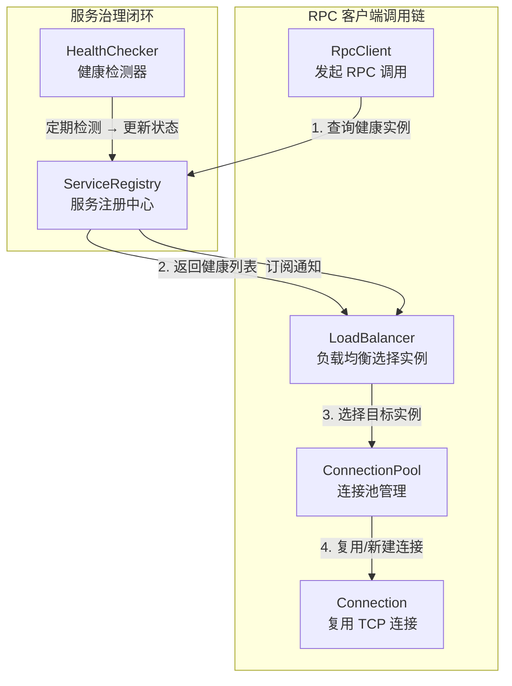
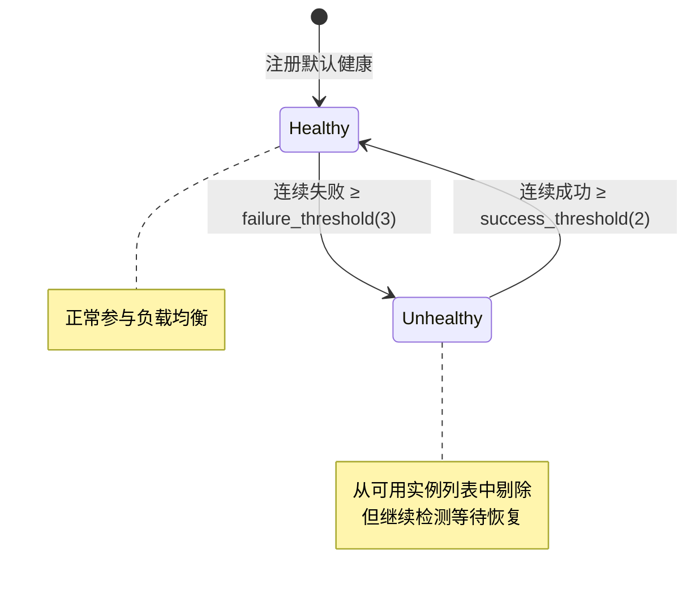
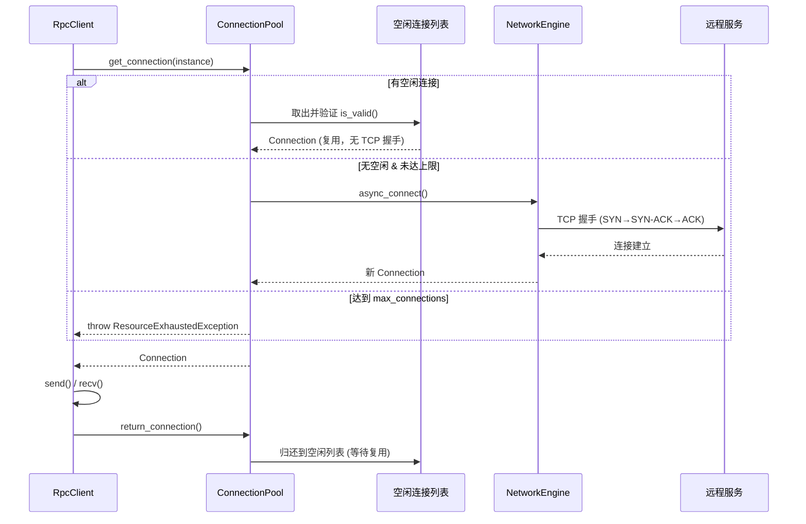
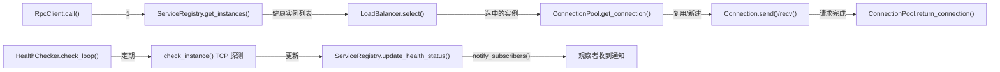

# FRPC 分布式服务治理：项目实现深度分析

> 分析简历描述「集成动态服务发现与健康检测机制，实现内置连接池的 RPC 客户端，采用负载均衡算法进行流量调度，有效降低 TCP 握手机制带来的额外开销，显著提升连接复用率」在代码中的具体体现。

---

## 架构全景



---

## 一、动态服务发现 — [ServiceRegistry](file:///Users/n/F/code/frpc/include/frpc/service_registry.h#151-157)

**关键文件**: [service_registry.h](file:///Users/n/F/code/frpc/include/frpc/service_registry.h) · [service_registry.cpp](file:///Users/n/F/code/frpc/src/service_registry.cpp)

### 核心设计

| 特性 | 实现方式 |
|------|---------|
| **服务注册/注销** | [register_service()](file:///Users/n/F/code/frpc/src/service_registry.cpp#12-51) / [unregister_service()](file:///Users/n/F/code/frpc/src/service_registry.cpp#52-92) 动态增删实例 |
| **健康过滤** | [get_instances()](file:///Users/n/F/code/frpc/src/service_registry.cpp#93-118) 只返回 `healthy == true` 的实例 |
| **变更通知（观察者模式）** | [subscribe()](file:///Users/n/F/code/frpc/src/service_registry.cpp#119-130) + `ChangeCallback` 推送实例列表变更 |
| **线程安全** | `std::shared_mutex` 读写锁，读操作并发、写操作互斥 |

### 关键代码体现

**1. 服务注册 — 心跳时间戳管理**

```cpp
// service_registry.cpp:36-43 — 新实例注册
InstanceInfo info;
info.instance = instance;
info.healthy = true;  // 默认健康
info.last_heartbeat = std::chrono::steady_clock::now();
instances.push_back(info);
```

**2. 健康过滤 — 只返回健康实例**

```cpp
// service_registry.cpp:106-111 — get_instances() 过滤不健康节点
std::vector<ServiceInstance> healthy_instances;
for (const auto& info : it->second) {
    if (info.healthy) {
        healthy_instances.push_back(info.instance);
    }
}
```

**3. 观察者模式 — 状态变更自动通知**

```cpp
// service_registry.cpp:162-167 — 只在状态真正变化时通知
if (status_changed) {
    notify_subscribers(service_name);
}
```

> [!IMPORTANT]
> [ServiceRegistry](file:///Users/n/F/code/frpc/include/frpc/service_registry.h#151-157) 是整个服务治理的**数据中枢**：HealthChecker 写入健康状态，LoadBalancer 读取健康实例列表，ConnectionPool 订阅变更以移除不健康连接。三个组件通过 Registry 解耦协作。

---

## 二、健康检测机制 — [HealthChecker](file:///Users/n/F/code/frpc/include/frpc/health_checker.h#179-180)

**关键文件**: [health_checker.h](file:///Users/n/F/code/frpc/include/frpc/health_checker.h) · [health_checker.cpp](file:///Users/n/F/code/frpc/src/health_checker.cpp)

### 检测策略



### 关键代码体现

**1. 协程驱动的异步检测循环**

```cpp
// health_checker.cpp:129-227 — check_loop() 协程
RpcTask<void> HealthChecker::check_loop() {
    while (running_.load()) {
        co_await std::suspend_always{};
        std::this_thread::sleep_for(config_.interval);  // 按间隔检测
        
        // 获取目标副本，避免长时间持锁
        std::vector<TargetInfo> targets_copy;
        { std::lock_guard lock(mutex_); targets_copy = targets_; }
        
        for (auto& target : targets_copy) {
            bool is_healthy = co_await check_instance(target.instance);
            // ... 状态机更新 ...
        }
    }
}
```

**2. 双阈值状态机 — 防抖动设计**

```cpp
// health_checker.cpp:170-182 — 恢复需要连续成功达到阈值
if (!target.currently_healthy && 
    target.consecutive_successes >= config_.success_threshold) {
    target.currently_healthy = true;
    registry_->update_health_status(target.service_name, target.instance, true);
}

// health_checker.cpp:192-204 — 故障需要连续失败达到阈值
if (target.currently_healthy && 
    target.consecutive_failures >= config_.failure_threshold) {
    target.currently_healthy = false;
    registry_->update_health_status(target.service_name, target.instance, false);
}
```

**3. 可配置的检测参数**

```cpp
// health_checker.h:56-102 — HealthCheckConfig
struct HealthCheckConfig {
    std::chrono::seconds interval{10};       // 检测间隔 10s
    std::chrono::seconds timeout{3};         // 超时 3s
    int failure_threshold = 3;               // 连续3次失败→不健康
    int success_threshold = 2;               // 连续2次成功→恢复
};
```

> [!TIP]
> 双阈值设计避免了网络抖动导致的实例状态频繁切换（flapping），这是生产级健康检测的标准做法。

---

## 三、内置连接池 — [ConnectionPool](file:///Users/n/F/code/frpc/include/frpc/connection_pool.h#383-392) + [Connection](file:///Users/n/F/code/frpc/include/frpc/connection_pool.h#118-120)

**关键文件**: [connection_pool.h](file:///Users/n/F/code/frpc/include/frpc/connection_pool.h) · [connection_pool.cpp](file:///Users/n/F/code/frpc/src/connection_pool.cpp)

### 连接生命周期



### 如何降低 TCP 握手开销

**1. 连接复用优先策略**

```cpp
// connection_pool.cpp:173-205 — get_connection() 优先取空闲连接
RpcTask<Connection> ConnectionPool::get_connection(const ServiceInstance& instance) {
    // 步骤1：先尝试读锁查看是否有空闲连接
    {
        std::shared_lock lock(mutex_);
        auto it = pools_.find(instance);
        if (it != pools_.end() && !it->second.idle_connections.empty()) {
            // 有空闲连接 → 复用！避免 TCP 三次握手
            Connection conn = std::move(it->second.idle_connections.back());
            it->second.idle_connections.pop_back();
            if (conn.is_valid()) co_return std::move(conn);
        }
    }
    // 步骤2：无空闲才创建新连接
    auto conn = co_await create_connection(instance);
    co_return std::move(conn);
}
```

**2. 使用后归还而非关闭**

```cpp
// connection_pool.cpp:242-263 — return_connection()
void ConnectionPool::return_connection(Connection conn) {
    if (!conn.is_valid()) {
        // 无效连接丢弃，计数减一
        pool.total_count--;
        return;
    }
    // 有效连接放回空闲列表，等待下次复用
    pool.idle_connections.push_back(std::move(conn));
}
```

**3. 按实例分桶管理**

```cpp
// connection_pool.h:589 — 每个 ServiceInstance 独立维护连接池
std::unordered_map<ServiceInstance, InstancePool, ServiceInstanceHash> pools_;
```

**4. 自动清理空闲超时连接**

```cpp
// connection_pool.cpp:303-333 — cleanup_idle_connections()
if (idle_time > config_.idle_timeout || !it->is_valid()) {
    it = pool.idle_connections.erase(it);
    pool.total_count--;
}
```

**5. 连接复用率统计**

```cpp
// connection_pool.h:322-327 — PoolStats
struct PoolStats {
    size_t total_connections = 0;
    size_t idle_connections = 0;
    size_t active_connections = 0;
    double connection_reuse_rate = 0.0;  // 复用率指标
};
```

> [!IMPORTANT]
> 连接池是「降低 TCP 握手开销，提升连接复用率」的**核心实现**。每次 RPC 调用优先从 [idle_connections](file:///Users/n/F/code/frpc/src/connection_pool.cpp#303-334) 取出已建立的连接，避免重复的三次握手（~1.5 RTT 开销）。用完后归还而非关闭，实现持久化复用。

---

## 四、负载均衡算法 — [LoadBalancer](file:///Users/n/F/code/frpc/include/frpc/load_balancer.h#44-71)

**关键文件**: [load_balancer.h](file:///Users/n/F/code/frpc/include/frpc/load_balancer.h) · [load_balancer.cpp](file:///Users/n/F/code/frpc/src/load_balancer.cpp)

### 四种策略对比

| 策略 | 类名 | 时间复杂度 | 线程安全机制 | 适用场景 |
|------|------|-----------|-------------|---------|
| **轮询** | [RoundRobinLoadBalancer](file:///Users/n/F/code/frpc/include/frpc/load_balancer.h#115-119) | O(1) | `atomic` 无锁 | 同质实例，均匀分配 |
| **随机** | [RandomLoadBalancer](file:///Users/n/F/code/frpc/include/frpc/load_balancer.h#180-204) | O(1) | `mutex` | 避免惊群效应 |
| **最少连接** | [LeastConnectionLoadBalancer](file:///Users/n/F/code/frpc/include/frpc/load_balancer.h#245-270) | O(n) | 依赖 Pool | 异构实例，请求耗时差异大 |
| **加权轮询** | [WeightedRoundRobinLoadBalancer](file:///Users/n/F/code/frpc/include/frpc/load_balancer.h#324-357) | O(n) | `mutex` | 灰度发布，按比例分流 |

### 关键代码体现

**1. 轮询 — 无锁原子操作**

```cpp
// load_balancer.cpp:24 — 原子递增 + 取模
size_t idx = index_.fetch_add(1, std::memory_order_relaxed) % instances.size();
```

**2. 加权轮询 — Nginx 平滑加权算法**

```cpp
// load_balancer.cpp:110-134 — Smooth Weighted Round-Robin
// 1. 所有实例当前权重 += 有效权重
for (auto& wi : weighted_instances_) {
    wi.current_weight += wi.effective_weight;
}
// 2. 选当前权重最大的
auto max_it = std::max_element(...);
// 3. 选中者当前权重 -= 总权重
max_it->current_weight -= total_weight;
```

**3. 策略模式 — 多态接口**

```cpp
// load_balancer.h:44-70 — 抽象基类
class LoadBalancer {
public:
    virtual ServiceInstance select(const std::vector<ServiceInstance>& instances) = 0;
};
```

---

## 五、各组件协作 — 完整调用链



### 数据流总结

1. **服务注册**: 服务提供者调用 `registry.register_service()` 注册实例
2. **健康检测**: [HealthChecker](file:///Users/n/F/code/frpc/include/frpc/health_checker.h#179-180) 协程定期 TCP 探测，通过双阈值状态机更新 [ServiceRegistry](file:///Users/n/F/code/frpc/include/frpc/service_registry.h#151-157) 中的健康状态
3. **服务发现**: `registry.get_instances()` 自动过滤不健康实例，返回可用列表
4. **负载均衡**: `LoadBalancer.select()` 从健康列表中按策略选择目标实例
5. **连接复用**: `ConnectionPool.get_connection()` 优先返回空闲连接，避免 TCP 握手
6. **RPC 调用**: 通过复用的 [Connection](file:///Users/n/F/code/frpc/include/frpc/connection_pool.h#118-120) 进行 [send()/recv()](file:///Users/n/F/code/frpc/src/connection_pool.cpp#77-105) 异步通信
7. **连接归还**: 调用完成后 [return_connection()](file:///Users/n/F/code/frpc/src/connection_pool.cpp#242-264) 归还连接到空闲池

---

## 六、测试覆盖

项目为每个模块都编写了充分的测试：

| 模块 | 单元测试 | 属性测试 |
|------|---------|---------|
| ServiceRegistry | [test_service_registry.cpp](file:///Users/n/F/code/frpc/tests/test_service_registry.cpp) (19KB) | [test_service_registry_properties.cpp](file:///Users/n/F/code/frpc/tests/test_service_registry_properties.cpp) (21KB) |
| HealthChecker | [test_health_checker.cpp](file:///Users/n/F/code/frpc/tests/test_health_checker.cpp) (8KB) | [test_health_checker_properties.cpp](file:///Users/n/F/code/frpc/tests/test_health_checker_properties.cpp) (13KB) |
| ConnectionPool | [test_connection_pool.cpp](file:///Users/n/F/code/frpc/tests/test_connection_pool.cpp) (6KB) | [test_connection_pool_properties.cpp](file:///Users/n/F/code/frpc/tests/test_connection_pool_properties.cpp) (14KB) |
| LoadBalancer | [test_load_balancer.cpp](file:///Users/n/F/code/frpc/tests/test_load_balancer.cpp) (12KB) | [test_load_balancer_properties.cpp](file:///Users/n/F/code/frpc/tests/test_load_balancer_properties.cpp) (12KB) |
| 端到端 | [test_integration_e2e.cpp](file:///Users/n/F/code/frpc/tests/test_integration_e2e.cpp) (15KB) | — |
